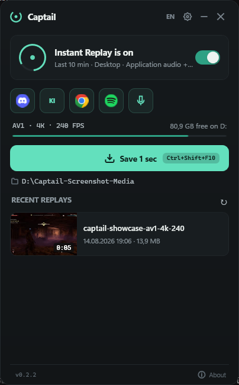
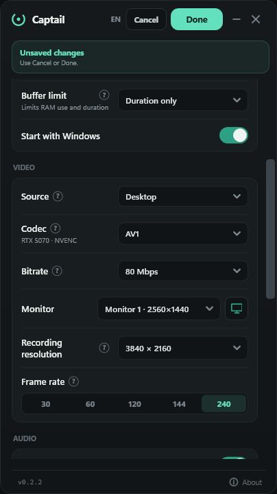
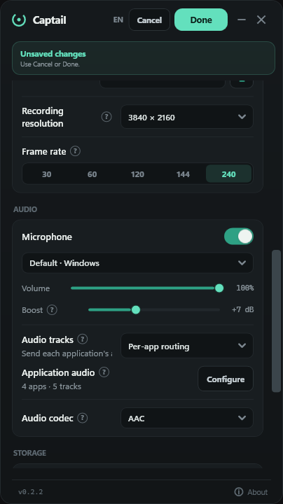
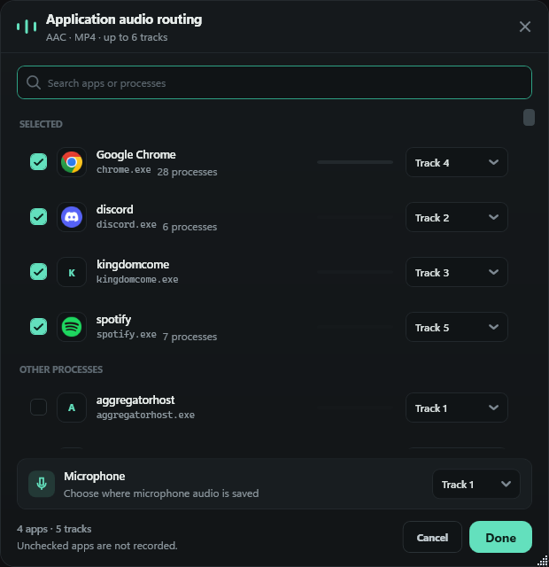
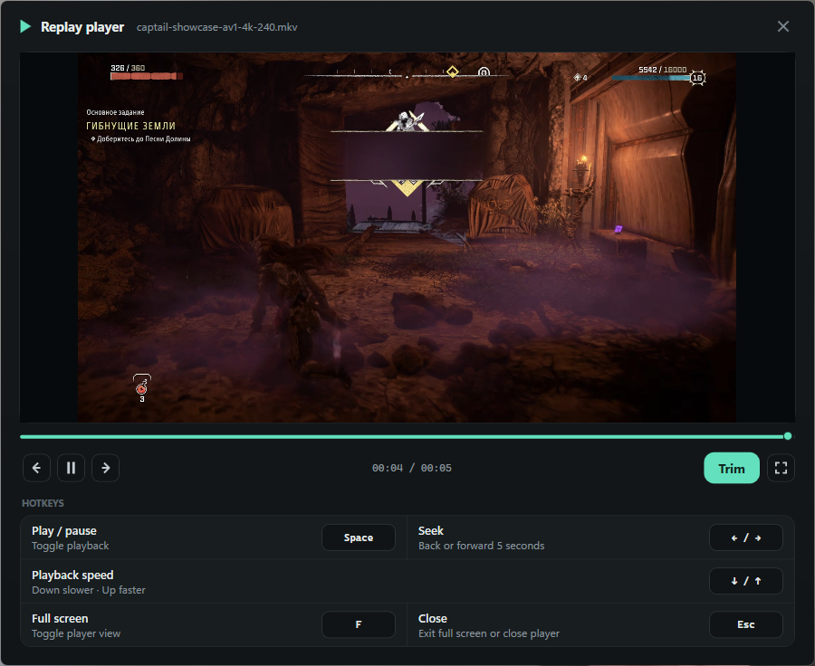
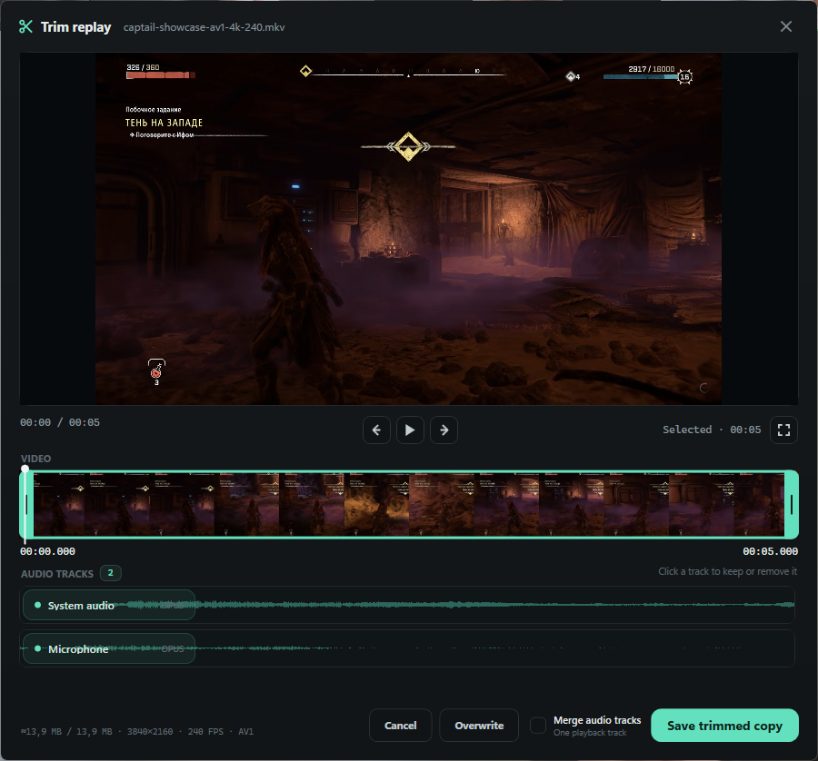

<p align="center">
  
</p>

<p align="center">
  <a href="https://github.com/FaulMit/captail/actions/workflows/ci.yml"></a>
  <a href="https://github.com/FaulMit/captail/releases"></a>
  <a href="LICENSE"></a>
  
</p>
<p align="center">
  <a href='https://ko-fi.com/Q4E824D8J4' target='_blank'></a>
</p>
<p align="center">
  <strong>Save what just happened.</strong><br>
  Lightweight, open-source instant replay for Windows — built to stay recording.
</p>

<p align="center">
  <a href="https://github.com/FaulMit/captail/releases/latest"></a>
  <a href="https://apps.microsoft.com/detail/9PKVNVLKPTPS"></a>
</p>

<p align="center">
  <a href="https://faulmit.github.io/captail/">Visit the Captail website</a>
  ·
  <a href="https://github.com/FaulMit/captail/issues/new/choose">Report a problem</a>
</p>

Captail is a focused alternative to NVIDIA ShadowPlay Instant Replay. It keeps the latest seconds or minutes in a rolling buffer, then saves them when you press a hotkey. No scenes, streaming setup, account, cloud upload, analytics, or telemetry.

> [!WARNING]
> Captail `v0.2.2` is an early public preview. Recording works, but bugs and hardware-specific problems are expected. NVIDIA RTX 40 and RTX 50 series are tested; other GPUs need broader public testing.

## What's new in Captail 0.2.2?

- Route audio from individual applications to separate recording tracks. Selected apps stay first, active audio sessions follow, and every other running process remains searchable.
- See real application icons and live level meters while assigning apps and microphone to tracks supported by the chosen audio format.
- Toggle routed application and microphone sources directly from the main window without reopening Settings.
- Preview every audio track found in a replay, keep or remove tracks independently, and use a taller editor layout when a file contains many tracks.
- Recover application-audio capture without stopping the replay buffer when a routed process exits or restarts.
- Keep the tray icon and replay-status indicator available after Windows startup, and avoid a shutdown crash caused by an already-disposed tray icon.

## Is Captail for me?

Captail is for Windows players who want instant replay without running a full streaming suite or wondering whether recording silently stopped.

It is a good fit if you want:

- one hotkey to save recent gameplay;
- desktop capture that automatically switches to a fullscreen game;
- a game-only mode that never records the desktop;
- real high-frame-rate capture for slow motion;
- system/game and microphone audio, mixed or separated;
- automatic recovery after recoverable capture, game, or driver failures;
- local files that stay on your PC.

Captail is not a streaming application, scene compositor, DRM bypass, or cloud clip service.

## What does it look like?


<p align="center">
  
</p>

<p align="center">
  
  
</p>

<p align="center">
  
</p>

<p align="center">
  
</p>

<p align="center">
  
</p>

## How do I install it?

Install Captail from [Microsoft Store](https://apps.microsoft.com/detail/9PKVNVLKPTPS), or open [GitHub Releases](https://github.com/FaulMit/captail/releases) and choose a package:

| Package | Choose it when | Installation |
| --- | --- | --- |
| **Microsoft Store** | You want Microsoft-managed installation and automatic updates | Open the [Store listing](https://apps.microsoft.com/detail/9PKVNVLKPTPS) and select **Install**. |
| `Captail-x.y.z-Setup-win-x64.exe` | You want the normal Windows experience | Run Setup. It installs Captail for your Windows account and adds an uninstaller to Windows Settings. |
| `Captail-x.y.z-Portable-win-x64.zip` | You want a movable, self-contained folder | Extract the entire ZIP, then run `Captail.exe` inside it. Do not run it from the archive. |
| `SHA256SUMS.txt` | You want to verify the download | Compare the package SHA-256 with the published value before running it. |

Every Captail package includes .NET, libobs, FFmpeg, and the embedded preview player. You do not need to install OBS Studio or extra runtimes.

> [!NOTE]
> Release binaries are not Authenticode-signed yet. Windows SmartScreen may show “Unknown publisher.” Verify `SHA256SUMS.txt` and GitHub build provenance if you want to confirm the download.

> [!IMPORTANT]
> Already using Captail `0.1.3` or `0.1.4`? Their updater contains a Windows file-lock bug. Download and run the `0.1.5` Setup EXE manually once. In-app updates work normally starting with `0.1.5`.

## How do I save my first replay?

1. Launch Captail. It stays available from the system tray.
2. Open Settings and choose **Desktop** or **Game Capture**.
3. Choose buffer length, codec, resolution, FPS, and audio sources.
4. Leave **Instant Replay** enabled.
5. Play normally.
6. Press `Ctrl+Shift+F10`, or click **Save**, when something worth keeping happens.

Default hotkeys:

| Action | Default |
| --- | --- |
| Save recent footage | `Ctrl+Shift+F10` |
| Enable or disable Instant Replay | `Ctrl+Shift+F9` |

Both hotkeys are configurable. Double-click the tray icon to reopen Captail.

The optional replay status indicator keeps recording state visible over games and desktop apps. It is enabled by default, can sit in any screen corner, ignores mouse input, and briefly confirms a successful save. Disable it or change its position in Replay settings.

Enable **Warn when a game starts** if you want one quiet reminder when Captail detects a game while Instant Replay is disabled. The reminder never enables recording automatically.

On first launch, Captail follows your Windows language when it supports it; otherwise it starts in English. Use the compact language control in the title bar to switch between English, Russian, Ukrainian, Simplified Chinese, Spanish, Brazilian Portuguese, German, French, Japanese, Korean, and Polish.

If similarly sized monitors are hard to distinguish, open Video settings and select **Identify displays** beside the monitor list. Captail briefly places a large number on each matching screen.

## What does each capture mode record?

| Mode | When no game is detected | When a fullscreen game appears | Audio source |
| --- | --- | --- | --- |
| **Desktop** | Records the selected monitor | Uses direct Game Capture when usable; otherwise keeps desktop video active while recognizing supported fullscreen games | Selected Windows output device |
| **Game Capture** | Keeps a lightweight game detector ready while the replay buffer sleeps | Wakes the replay buffer and captures the detected game directly | Detected game audio |

Use **Desktop** when you want continuous coverage; use **Game Capture** when privacy and low idle resource use outside games matter more. In Game Capture mode, Captail wakes the replay buffer only after a plausible game appears. When a fullscreen game cannot be hooked, Desktop mode favors uninterrupted video over pretending direct Game Capture is working.

## What happens when capture breaks?

Captail supervises the recording pipeline instead of assuming that a successful start means it will remain healthy forever.

| Situation | Expected behavior |
| --- | --- |
| Game closes or crashes | Desktop mode returns to desktop capture. Game Capture mode waits for another game. |
| You switch between game and desktop | Desktop mode follows the active capture source without stopping the buffer. |
| A capture source temporarily disappears | Captail keeps the pipeline supervised and retries recovery. |
| Graphics driver restarts | Video may pause or go black temporarily; the watchdog attempts a controlled restart with retry delay. |
| Recovery cannot complete | Captail reports the failure and retries instead of silently claiming that replay is active. |
| DRM-protected video appears | Protected regions may be black. Captail does not bypass DRM and is designed to keep the buffer running. |

Recovery reduces lost footage; it cannot guarantee frames that Windows, a game, an anti-cheat system, or a failed driver never delivered.

## Where is the rolling buffer stored?

The live replay buffer stores compressed video and audio packets in **RAM**. Only saved replays are written to your selected folder.

- **Buffer length** controls how much recent time Captail tries to keep.
- **Buffer limit** caps compressed replay data in RAM. If it is reached first, available replay time becomes shorter.
- **Bitrate, resolution, FPS, and codec** affect both memory use and saved file size.
- The dashboard shows free space on the drive containing your replay folder.

After a successful save, Captail starts a new replay segment. Saving again five minutes later produces roughly five minutes of new footage instead of duplicating the previous clip.

## Which codec should I choose?

Captail detects the current GPU and driver, then hides unavailable hardware codecs.

| Codec | Best for | Trade-off |
| --- | --- | --- |
| **AV1** | Best compression on supported modern GPUs | Newest format; some older players and editors may not support it. Hardware support commonly includes GeForce RTX 40/50, Radeon RX 7000, and Intel Arc. |
| **HEVC / H.265** | Good compression with broader modern-GPU support | Compatibility is better than AV1 but still weaker than H.264 in older software. |
| **H.264 / AVC** | Easiest playback, editing, and sharing | Larger files or lower quality at the same bitrate. |

Unsure? Start with **H.264** for compatibility. Use **AV1** when your GPU and editor support it and file efficiency matters.

## Does 240 FPS mean 240 real frames?

Captail requests real frames from the capture source; it does not generate duplicates to make a file report a higher FPS.

- **Game Capture:** can record distinct high-rate frames when the game, GPU, encoder, and capture path can sustain them.
- **Desktop capture:** limited by how often Windows and the monitor present new desktop frames.
- **Slow motion:** 120–240 FPS is useful only when the source actually produces that many distinct frames.

Higher FPS raises GPU load, RAM use, and file size. Captail supports 30, 60, 120, 144, and 240 FPS.

## How does audio work?

You can record system or detected-game audio, a microphone, or both.

- Change system and microphone volume independently.
- Add up to `+20 dB` microphone boost when 100% is still too quiet.
- Use **One mixed track** for maximum player compatibility.
- Use **Separate tracks** to keep system/game audio and microphone independent for editing.
- Use **Per-app routing** to select individual running applications and assign each one to an available recording track. Selected apps stay at the top, followed by apps currently playing audio and then other running processes.
- Choose AAC in fragmented MP4 or Opus in MKV.

The selected audio codec and container determine how many tracks are available. Captail shows real application icons and live level meters in the routing window, and exposes routed sources as quick toggles on the main screen.

Some media players play only one track from a multi-track file. Captail's clip editor previews every available track together and lets you keep or remove each track from the trimmed result.

## Can I manage and trim replays inside Captail?

Yes. The main window lists supported files from the selected replay folder in a scrollable library.

- Open a replay in File Explorer.
- Move it to the Recycle Bin after confirmation.
- Play it immediately without entering edit mode.
- Seek, pause, use fullscreen, and change playback speed from `0.25×` to `2×` with the keyboard.
- Scrub through a responsive preview.
- Select one trim range with draggable handles.
- Keep or remove each audio track.
- Save a new copy or overwrite the original after confirmation.
- See estimated output size, original size, resolution, source FPS, and codec.

Trimming uses stream copy when possible, avoiding a full video re-encode.

## Can Captail organize clips by game?

Enable **Organize games into folders** in Storage. Replays saved while a game is detected go into a folder named after that game's executable. Replays saved while Desktop remains active stay in the main replay folder.

## Does Captail send or upload my recordings?

No. Captail has no account, cloud upload, analytics, or telemetry. Replays, thumbnails, settings, and logs stay on your PC.

GitHub builds contact the GitHub Releases API to check whether a newer version exists. They download an update package only after you click the update control. The Microsoft Store build uses Store-managed updates instead.

## How is Captail different from ShadowPlay and OBS Replay Buffer?

| | Captail | ShadowPlay | OBS Replay Buffer |
| --- | --- | --- | --- |
| Primary job | Instant replay | NVIDIA capture suite | Recording/streaming production |
| GPU support goal | NVIDIA, AMD, Intel hardware encoders | NVIDIA | Broad through OBS |
| Setup | Choose settings and leave it in tray | GeForce/NVIDIA App | Configure scenes, sources, and output |
| Automatic desktop/game switching | Yes, in Desktop mode | Platform-managed | Requires scene/source setup |
| Capture watchdog and recovery | Built around automatic supervision | Internal behavior | Not Captail's focused workflow |
| Built-in replay library and trim editor | Yes | Varies by NVIDIA software version | No focused clip library |
| Open source | Yes | No | Yes |

Captail uses libobs for capture and encoding, but it is not an OBS Studio frontend. It exposes no streaming, scenes, transitions, or plugin management because those features would work against its small, single-purpose UI.

## Will it work on my PC?

Requirements:

- Windows 10 version 2004 or newer, or Windows 11;
- x64 processor and operating system;
- a GPU and driver exposing a supported hardware H.264, HEVC, or AV1 encoder.

Current hardware status:

| Hardware | Status |
| --- | --- |
| NVIDIA GeForce RTX 50 series | Tested |
| NVIDIA GeForce RTX 40 series | Tested |
| Older NVIDIA GPUs | Not yet verified; expected to work when supported by libobs/NVENC |
| AMD GPUs | Capability detection implemented; public hardware testing needed |
| Intel GPUs | Capability detection implemented; public hardware testing needed |

Codec options are based on detected encoder support. Captail falls back to another available codec if a previously selected encoder disappears.

## What are the current limitations?

- This is an early preview; hardware-specific bugs are expected.
- Release binaries are not Authenticode-signed.
- Some games or anti-cheat configurations may block Game Capture.
- DRM-protected regions cannot be recorded and may appear black.
- Desktop capture cannot create unique frames beyond the desktop presentation rate.
- Older NVIDIA, AMD, and Intel hardware needs more real-world testing.

## What information should I include in a bug report?

First check [existing issues](https://github.com/FaulMit/captail/issues), then click **Report bug** in Captail or open the [bug report form](https://github.com/FaulMit/captail/issues/new/choose).

The in-app button prefills Captail version, package channel, Windows build, GPU and driver when available, recording configuration, and a short recent diagnostic excerpt. Captail removes personal paths, network addresses, identifiers, window titles, device names, secrets, and uncontrolled third-party output before opening GitHub. Review the form before submitting it; the complete local log and recorded files are never attached automatically.

Include:

- Captail version and Setup/Portable package type;
- Windows version;
- GPU model and graphics-driver version;
- capture mode, codec, resolution, FPS, and audio configuration;
- exact reproduction steps and expected/actual behavior;
- additional log context only when the sanitized excerpt does not cover the problem.

Review logs before attaching them and remove personal paths or other sensitive information. Report security vulnerabilities privately through the process in [SECURITY.md](SECURITY.md).

Compatibility reports for older NVIDIA, AMD, and Intel GPUs are useful even when everything works.

Have an improvement rather than a bug? Open **About → Feature** to use Captail's focused feature-request template.

## How do I build or contribute?

Development requires Windows 10/11 x64, .NET 9 SDK, CMake 3.20+, and Visual Studio 2022 Build Tools with **Desktop development with C++**.

```powershell
git clone https://github.com/FaulMit/captail.git
cd captail
dotnet restore .\src\Captail\Captail.csproj --locked-mode
dotnet build .\Captail.sln -c Debug --no-restore
```

The first build acquires the pinned OBS and FFmpeg runtimes when they are missing.

Read [CONTRIBUTING.md](CONTRIBUTING.md) before submitting changes. Release maintainers should use [docs/RELEASING.md](docs/RELEASING.md) and the [README screenshot plan](docs/SCREENSHOTS.md); published binaries are built and verified by GitHub Actions.

## License and attribution

Captail is licensed under [GNU GPL-2.0-or-later](LICENSE).

Privacy details are documented in [PRIVACY.md](PRIVACY.md).

Captail uses libobs and selected OBS Studio runtime components. See [THIRD_PARTY_NOTICES.md](THIRD_PARTY_NOTICES.md).

Captail is not affiliated with or endorsed by NVIDIA or OBS Project. NVIDIA and ShadowPlay are trademarks of NVIDIA Corporation.
